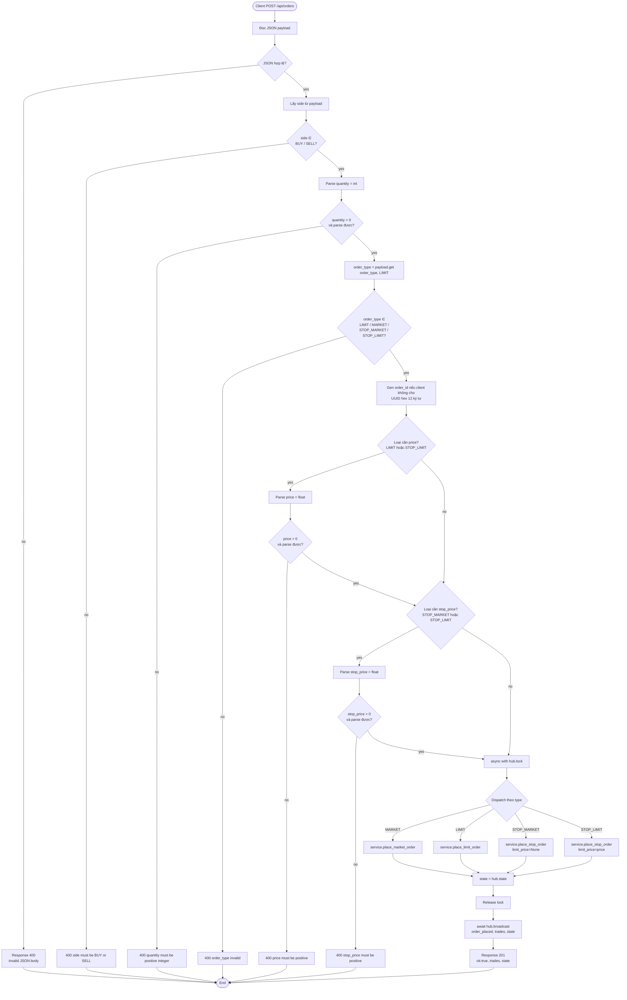
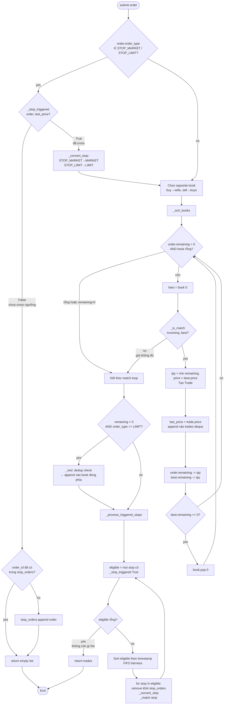
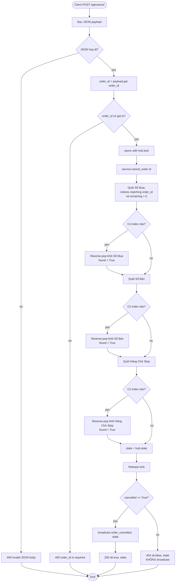
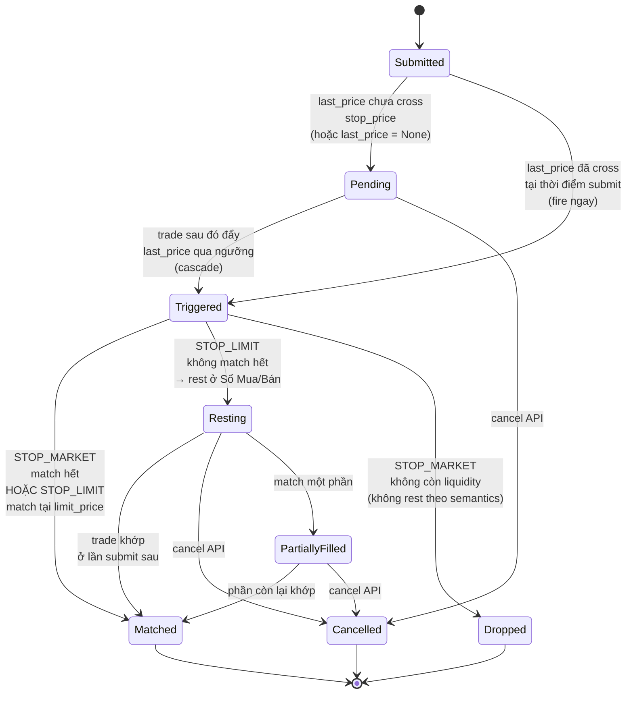
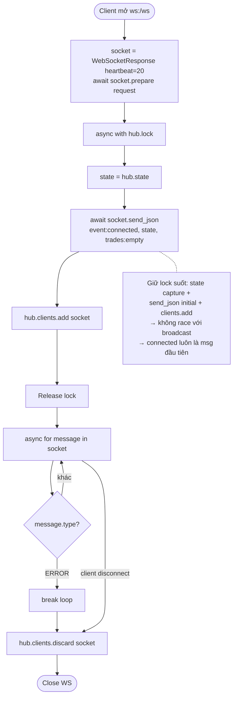
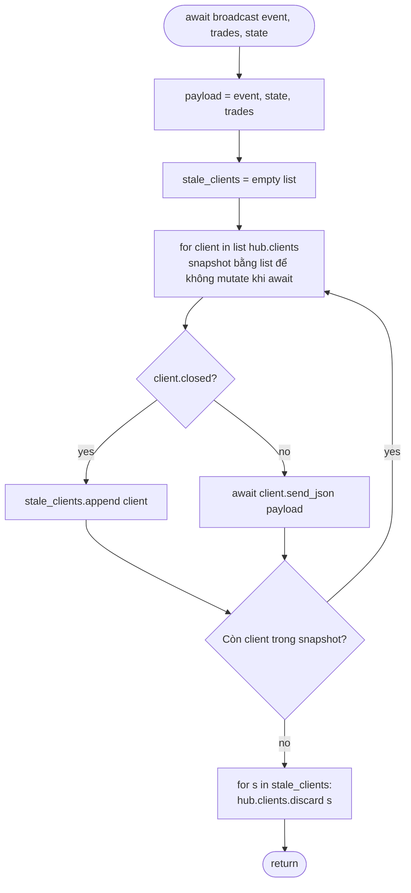
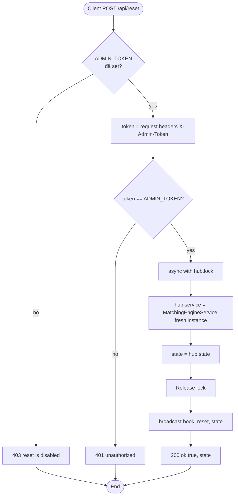
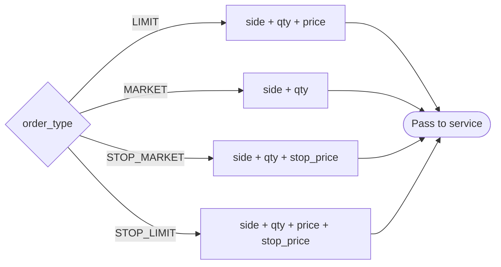

# Activity Diagrams — Matching Engine Project

Các activity diagram ở dạng Mermaid mô tả workflow & control flow của các tính năng chính.

> **Quy ước ký hiệu**
> - `([...])` — điểm bắt đầu / kết thúc
> - `[...]` — action / step
> - `{...}` — decision point
> - `-->|nhãn|` — nhánh có điều kiện

---

## 1. Place Order — End-to-End Flow

Từ `POST /api/orders` đến broadcast WS. Bao phủ tất cả 4 order_type (LIMIT / MARKET / STOP_MARKET / STOP_LIMIT) cùng mọi validation early-return.

---

## 2. OrderBook.submit — Core Matching + Cascade

Bên trong `OrderBook.submit()`: dispatch stop vs. non-stop, match loop, rest logic, và cascade trigger pending stops.

---

## 3. Cancel Order Flow

Flow của `POST /api/cancel` và bên trong `OrderBook.cancel()`.

---

## 4. Stop Order Lifecycle (State Diagram)

Vòng đời một stop order từ lúc được submit đến khi kết thúc.

---

## 5. WebSocket Connection Handler

Flow của `/ws` upgrade request, từ client connect đến disconnect.

---

## 6. Broadcast Activity (Fan-out)

Bên trong `EngineHub.broadcast()`.

---

## 7. Reset Book Flow

`POST /api/reset` (admin-gated sau BUG-13 fix).

---

## 8. Decision Matrix — Order Type × Validation

Tóm tắt nhanh fields nào cần cho loại nào (activity-level checklist):

---

## Mapping Activity → Source

| Activity Diagram | File / Hàm |
|------------------|-------------|
| Place Order (1) | `matching_engine/web.py:place_order` |
| OrderBook.submit (2) | `matching_engine/order_book.py:submit` + `_match` + `_process_triggered_stops` |
| Cancel Order (3) | `matching_engine/web.py:cancel_order` + `order_book.py:cancel` |
| Stop Lifecycle (4) | `order_book.py` stop-handling branches |
| WS Handler (5) | `matching_engine/web.py:websocket_handler` |
| Broadcast (6) | `matching_engine/web.py:EngineHub.broadcast` |
| Reset Book (7) | `matching_engine/web.py:reset_book` |
| Order Type Matrix (8) | `matching_engine/web.py:place_order` validation block |
