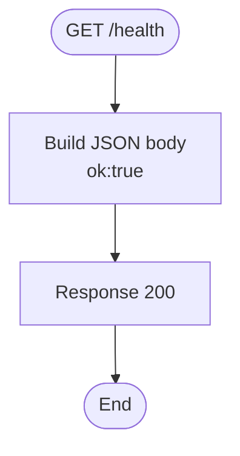
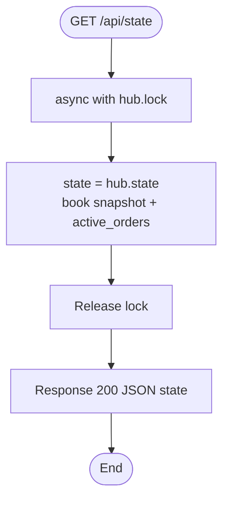
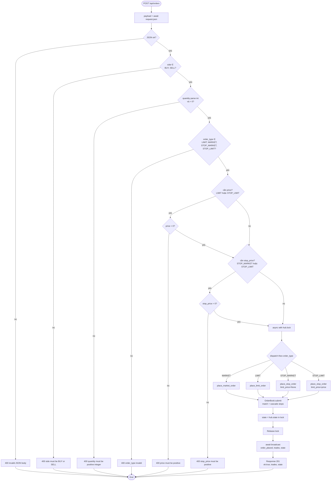
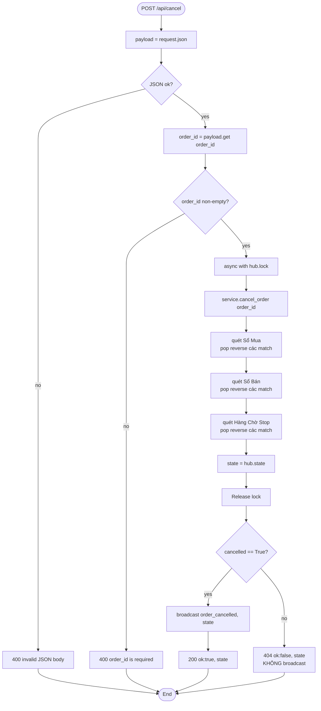
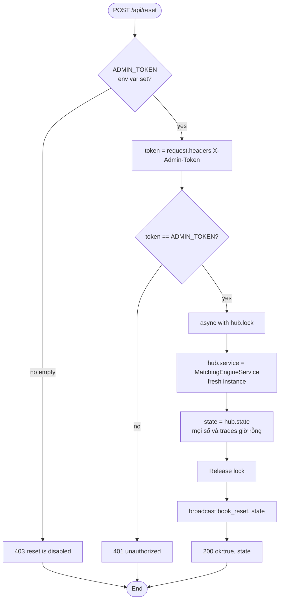
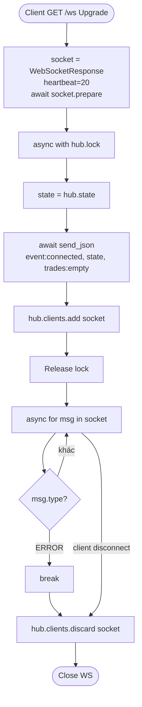
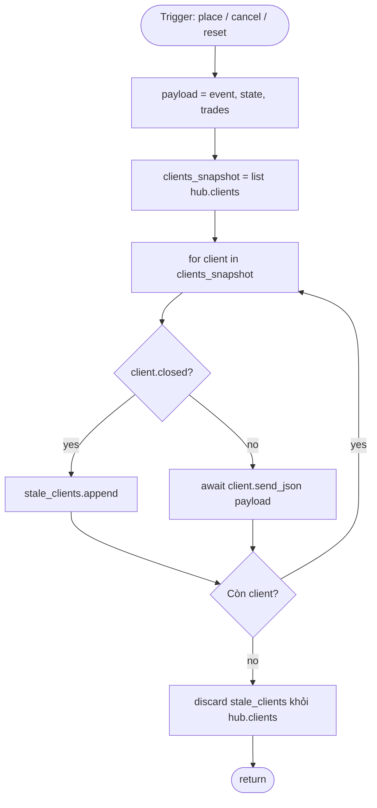
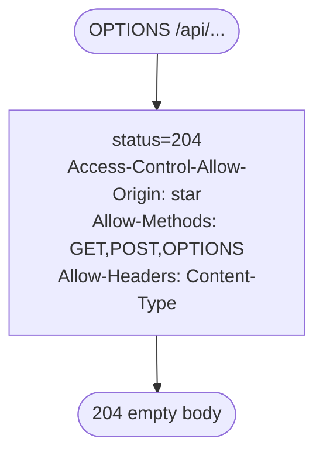
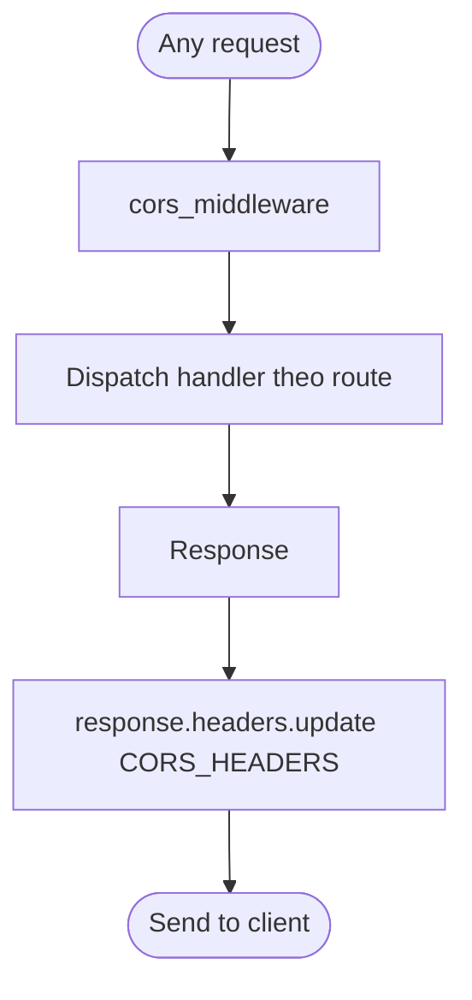

# API Activity by Endpoint

Mô tả luồng hoạt động của từng API endpoint trong matching engine, kèm request/response schema và activity diagram Mermaid.

## Tổng quan Endpoint

| Method | Path | Purpose | Auth |
|--------|------|---------|------|
| `GET` | `/health` | Healthcheck liveness probe | — |
| `GET` | `/api/state` | Snapshot sổ lệnh + trades + last_price | — |
| `POST` | `/api/orders` | Đặt LIMIT / MARKET / STOP_MARKET / STOP_LIMIT | — |
| `POST` | `/api/cancel` | Hủy LIMIT resting hoặc STOP pending | — |
| `POST` | `/api/reset` | Wipe toàn bộ state (admin) | `X-Admin-Token` |
| `GET` | `/ws` | Upgrade WebSocket để nhận broadcast realtime | — |
| `OPTIONS` | `/api/{tail}` | CORS preflight | — |

---

## 1. `GET /health` — Liveness Probe

**Purpose:** Cho load balancer / k8s biết process còn sống.

**Response (200):**
```json
{"ok": true}
```

### Activity Diagram



**Ghi chú:** Handler thuần, không touch engine state, không acquire lock — dùng được cả khi lock bị contention.

---

## 2. `GET /api/state` — Snapshot Read

**Purpose:** Lấy state hiện tại của engine để initial render hoặc poll fallback khi WS mất.

**Response (200):**
```json
{
  "book": {
    "buys":  [{ "order_id":"B1","side":"BUY","quantity":5,"remaining":5,
                "price":100.0,"order_type":"LIMIT","stop_price":null,"timestamp":... }],
    "sells": [...],
    "stops": [{ "order_id":"SM1","order_type":"STOP_MARKET","stop_price":105.0,... }],
    "trades": [{ "buy_order_id":"B1","sell_order_id":"S1","price":100.0,
                 "quantity":5,"aggressor_order_id":"B1","timestamp":... }],
    "last_price": 100.0
  },
  "active_orders": [ ...merge buys+sells+stops, sort theo timestamp ]
}
```

### Activity Diagram



**Key point:** Lock (BUG-10 fix) ngăn đọc state giữa chừng một operation khi engine refactor thành async. Hiện tại engine sync nên nguy cơ latent, preemptive lock.

---

## 3. `POST /api/orders` — Place Order (Phức Tạp Nhất)

**Purpose:** Đặt lệnh LIMIT / MARKET / STOP_MARKET / STOP_LIMIT.

### Request schema (theo `order_type`)

| Field | LIMIT | MARKET | STOP_MARKET | STOP_LIMIT |
|-------|:-----:|:------:|:-----------:|:----------:|
| `side` | ✔ | ✔ | ✔ | ✔ |
| `quantity` | ✔ | ✔ | ✔ | ✔ |
| `price` | ✔ | — | — | ✔ (limit price) |
| `stop_price` | — | — | ✔ | ✔ |
| `order_type` | ✔ | ✔ | ✔ | ✔ |
| `order_id` | optional | optional | optional | optional |
| `timestamp` | optional | optional | optional | optional |

**Response 201:**
```json
{"ok": true, "trades": [...], "state": {...}}
```

**Response 400 (validation fail):**
```json
{"ok": false, "error": "<message cụ thể>"}
```

### Activity Diagram



### Error matrix

| Điều kiện | Status | Body |
|-----------|--------|------|
| JSON body không parse được | 400 | `invalid JSON body` |
| `side` không thuộc `{BUY, SELL}` | 400 | `side must be BUY or SELL` |
| `quantity` thiếu / không phải int / ≤ 0 | 400 | `quantity must be a positive integer` |
| `order_type` không thuộc whitelist | 400 | `order_type must be one of (...)` |
| `price` thiếu cho LIMIT/STOP_LIMIT hoặc ≤ 0 | 400 | `price must be positive` |
| `stop_price` thiếu cho STOP_* hoặc ≤ 0 | 400 | `stop_price must be positive` |
| OK | 201 | `{ok, trades, state}` |

---

## 4. `POST /api/cancel` — Cancel Order

**Purpose:** Hủy LIMIT resting, MARKET nửa-rested (hiếm), hoặc STOP pending.

### Request

```json
{ "order_id": "SM1" }
```

### Response

- **200** `{ok:true, state}` — cancel thành công
- **404** `{ok:false, state}` — không tìm thấy (đã filled, đã cancel, hoặc ID sai)
- **400** `{ok:false, error}` — payload invalid

### Activity Diagram



### Lưu ý

- **Idempotence partial:** gọi cancel lần 2 → 404 (order đã biến mất). Client phải xử lý cả 200 và 404 như "đã cancel xong".
- **No broadcast khi not found:** tránh spam WS với event rỗng.
- **Cover đủ 3 container** sau khi bổ sung stop orders — cùng 1 API cho mọi loại.

---

## 5. `POST /api/reset` — Admin Reset Book

**Purpose:** Wipe toàn bộ engine state về zero (dùng cho dev/test/incident).

### Auth

- Env var `ADMIN_TOKEN` phải được set (không rỗng) — ngược lại endpoint trả 403.
- Client gửi header `X-Admin-Token: <token>` khớp với env.

### Request/Response

```http
POST /api/reset HTTP/1.1
X-Admin-Token: <token>
```

- **200** `{ok:true, state}` — reset thành công (state mới rỗng)
- **401** `{ok:false, error:"unauthorized"}` — token sai
- **403** `{ok:false, error:"reset is disabled"}` — chưa cấu hình ADMIN_TOKEN

### Activity Diagram



### Bảo mật

- BUG-13 fix: nguyên gốc endpoint không auth, ai cũng DoS được. Giờ cần token.
- SEC-10 chưa fix: token compare dùng `!=` string — timing attack khả thi. Fix đề xuất: `hmac.compare_digest()`.

---

## 6. `GET /ws` — WebSocket Upgrade + Realtime Broadcast

**Purpose:** Client subscribe để nhận event `order_placed` / `order_cancelled` / `book_reset` kèm state snapshot.

### Event schema (server → client)

```json
{
  "event": "order_placed" | "order_cancelled" | "book_reset" | "connected",
  "state": { ... giống /api/state ... },
  "trades": [ ... trades mới tạo (chỉ có trong order_placed) ... ]
}
```

### Activity Diagram



### Key invariants

- **Initial state luôn đến trước** bất kỳ broadcast nào (BUG-08 fix): vì `send_json + clients.add` nằm trong lock → mọi broadcast sau đó (phải acquire lock) chỉ chạy được sau khi client đã có initial state.
- **Heartbeat 20s** auto-ping để detect disconnect.
- **Cleanup trong `finally`** đảm bảo client được remove khỏi `hub.clients` kể cả khi loop raise exception.

### Broadcast pipeline (trigger bởi endpoint khác)



---

## 7. `OPTIONS /api/{tail}` — CORS Preflight

**Purpose:** Trình duyệt preflight check trước khi POST/GET cross-origin.

**Response:** 204 No Content với CORS headers.

### Activity Diagram



**Lưu ý bảo mật:** CORS `*` + không auth = SEC-05 (cross-origin trade từ browser victim). Nên whitelist origin cụ thể trong prod.

---

## Cross-cutting Concerns

### Lock ownership theo endpoint

| Endpoint | Cần `hub.lock`? | Tại sao |
|----------|:---------------:|---------|
| `GET /health` | ❌ | Không đọc state |
| `GET /api/state` | ✔ (BUG-10) | Tránh read-during-mutate |
| `POST /api/orders` | ✔ | Mutate sổ + snapshot |
| `POST /api/cancel` | ✔ | Mutate sổ + snapshot |
| `POST /api/reset` | ✔ | Swap service instance |
| `GET /ws` (handshake) | ✔ | Atomic initial-send + clients.add |
| `OPTIONS` | ❌ | Static response |

### Broadcast decision theo endpoint

| Endpoint | Broadcast event | Điều kiện |
|----------|-----------------|-----------|
| `POST /api/orders` | `order_placed` | Luôn broadcast (kể cả no trades) |
| `POST /api/cancel` | `order_cancelled` | Chỉ khi `cancelled == True` |
| `POST /api/reset` | `book_reset` | Luôn |
| `GET /ws` | `connected` | Chỉ gửi cho client đó, không phải broadcast |

### Middleware chung



CORS middleware áp dụng cho **mọi response**, đảm bảo browser cross-origin luôn thấy headers.

---

## Mapping Endpoint → Handler

| Endpoint | Handler | File |
|----------|---------|------|
| `GET /health` | `health` | `matching_engine/web.py` |
| `GET /api/state` | `get_state` | `matching_engine/web.py` |
| `POST /api/orders` | `place_order` | `matching_engine/web.py` |
| `POST /api/cancel` | `cancel_order` | `matching_engine/web.py` |
| `POST /api/reset` | `reset_book` | `matching_engine/web.py` |
| `GET /ws` | `websocket_handler` | `matching_engine/web.py` |
| `OPTIONS /api/*` | `options_handler` | `matching_engine/web.py` |
