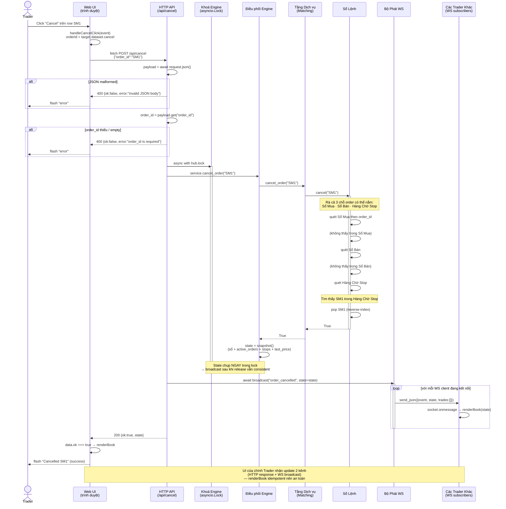
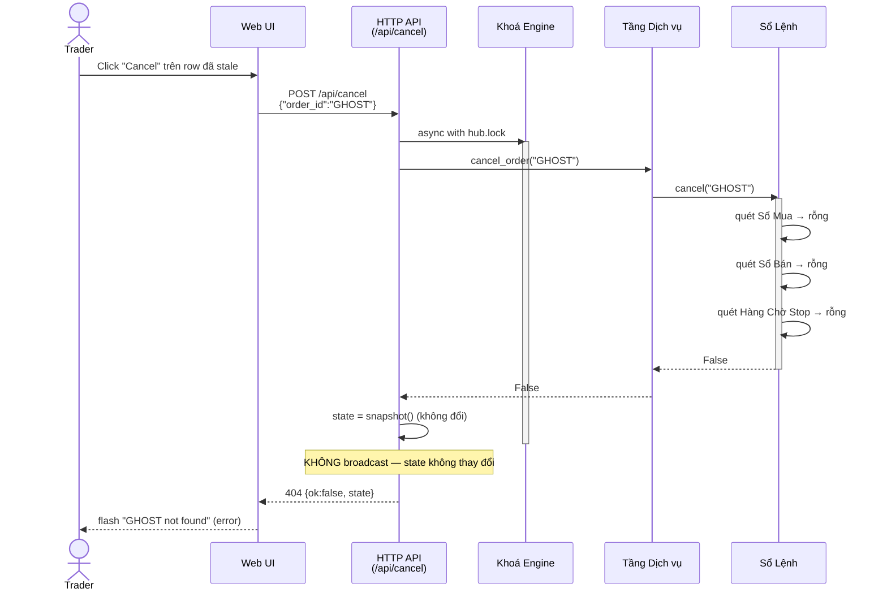
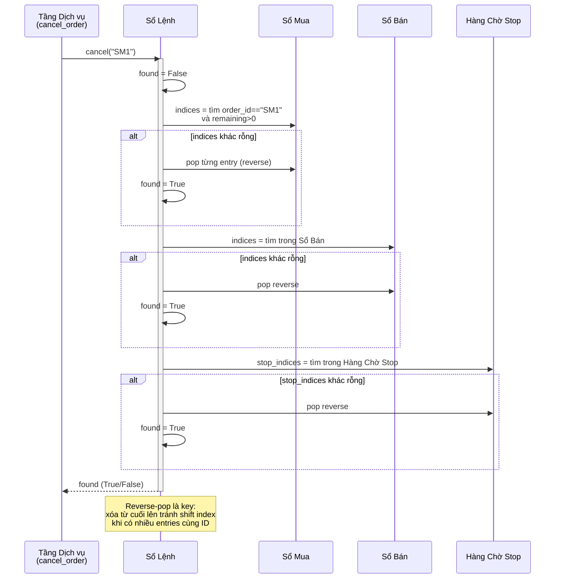
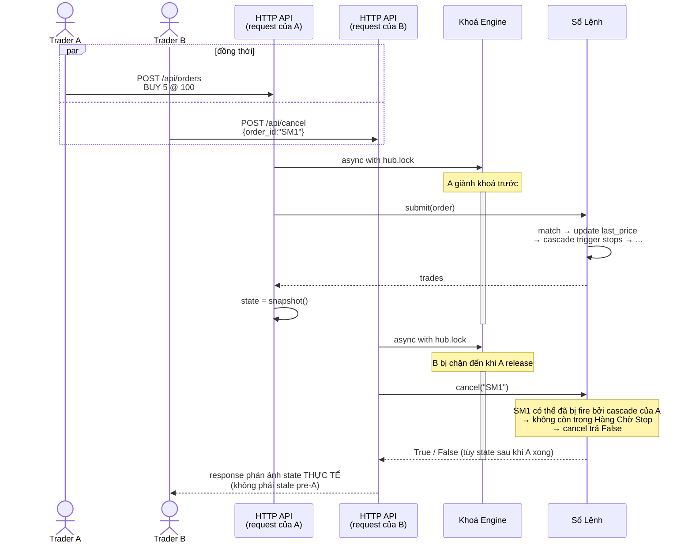

# Cancel Pending Order — Module Interaction Sequence

Sequence diagram tả lại toàn bộ đường đi của một request cancel, từ click UI đến re-render realtime, có đủ các nhánh: hủy LIMIT resting, hủy STOP pending, và case not-found.

> **Quy ước đặt tên module (trong tất cả diagram)**
>
> | Tên trong diagram | Vai trò | Thực tế trong codebase |
> |-------------------|---------|------------------------|
> | **Trader** | Người dùng cuối click UI | - |
> | **Web UI** | Giao diện trình duyệt | `frontend/static/app.js` |
> | **HTTP API** | Cổng nhận request, validate, trả response | `matching_engine/web.py` handlers |
> | **Khoá Engine** | Serialize truy cập engine (mutex) | `hub.lock` (asyncio.Lock) |
> | **Điều phối Engine** | Giữ service + clients + broadcast | `EngineHub` |
> | **Tầng Dịch vụ** | API domain (place/cancel/query) | `MatchingEngineService` |
> | **Sổ Lệnh** | Core matching state | `OrderBook` |
> | **Bộ Phát WS** | Fan-out message cho mọi client | `hub.broadcast()` |
> | **Các Trader Khác** | WS subscribers khác | connected `WebSocketResponse` |
> | **Sổ Mua / Bán** | Hai phía của LIMIT book | `self.buys`, `self.sells` |
> | **Hàng Chờ Stop** | Nơi parked các stop chưa trigger | `self.stop_orders` |

---

## 1. Happy Path Đầy Đủ (End-to-end All Modules)

---

## 2. Nhánh Not-Found (Order Không Tồn Tại / Đã Filled / Đã Cancel Trước Đó)

---

## 3. Bên Trong Sổ Lệnh — Quét 3 Container

Zoom vào `OrderBook.cancel()` để thấy vì sao một API duy nhất cover được cả LIMIT resting, triggered LIMIT sau cascade, và STOP pending:

---

## 4. Race Với Place Order — Vì Sao Cần Khoá Engine

Minh họa lý do phải có mutex: nếu `place_order` đang cascade trigger stops mà `cancel` đọc state giữa chừng, có thể cancel một order đang được match → zombie. Khoá Engine loại bỏ khả năng này.

---

## Invariants Được Bảo Vệ

| Invariant | Đảm bảo bởi |
|-----------|-------------|
| Cancel là atomic với place/match | `async with hub.lock` bao cả scan + pop + state snapshot |
| Cancel cover mọi nơi order có thể ở | Sổ Lệnh quét Sổ Mua + Sổ Bán + Hàng Chờ Stop |
| Nhiều entries cùng ID không leak zombie | Reverse-pop toàn bộ indices (BUG-03 fix) |
| Broadcast không gửi state sai sau cancel failed | `if cancelled: broadcast(...)` — bỏ qua khi không đổi |
| Frontend không out-of-sync với backend | Response có `state` field + WS broadcast đồng thời (cùng `renderBook`) |
| Không có race "cancel sau khi đã fill" | State chỉ mutate trong lock, scan cũng trong lock → thấy đúng state thời điểm cancel |

---

## Mapping Module → File

| Tên trong diagram | File / Symbol |
|-------------------|----------------|
| Web UI (trình duyệt) | `frontend/static/app.js` → `handleCancelClick` |
| HTTP API (/api/cancel) | `matching_engine/web.py` → `cancel_order` |
| Khoá Engine | `matching_engine/web.py` → `EngineHub.lock` (asyncio.Lock) |
| Điều phối Engine | `matching_engine/web.py` → `EngineHub` |
| Tầng Dịch vụ | `matching_engine/service.py` → `MatchingEngineService.cancel_order` |
| Sổ Lệnh | `matching_engine/order_book.py` → `OrderBook.cancel` |
| Sổ Mua / Sổ Bán / Hàng Chờ Stop | `OrderBook.buys` / `sells` / `stop_orders` |
| Bộ Phát WS | `matching_engine/web.py` → `EngineHub.broadcast` |
| Các Trader Khác | connected `aiohttp.web.WebSocketResponse` trong `hub.clients` |
