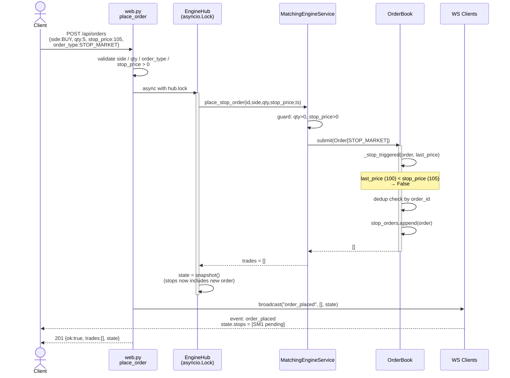
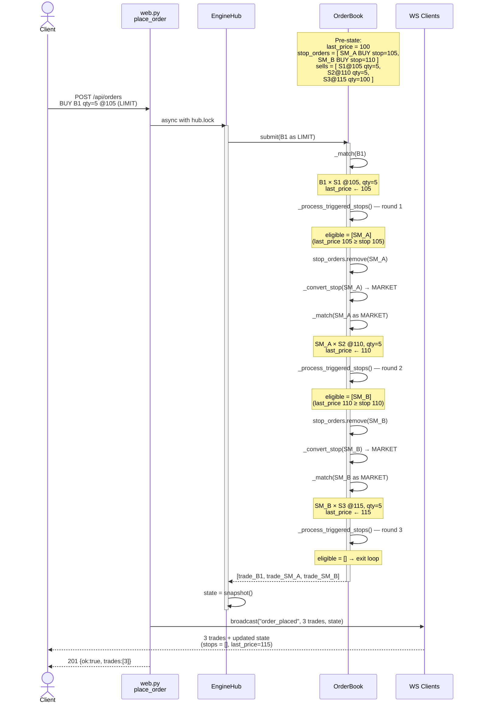
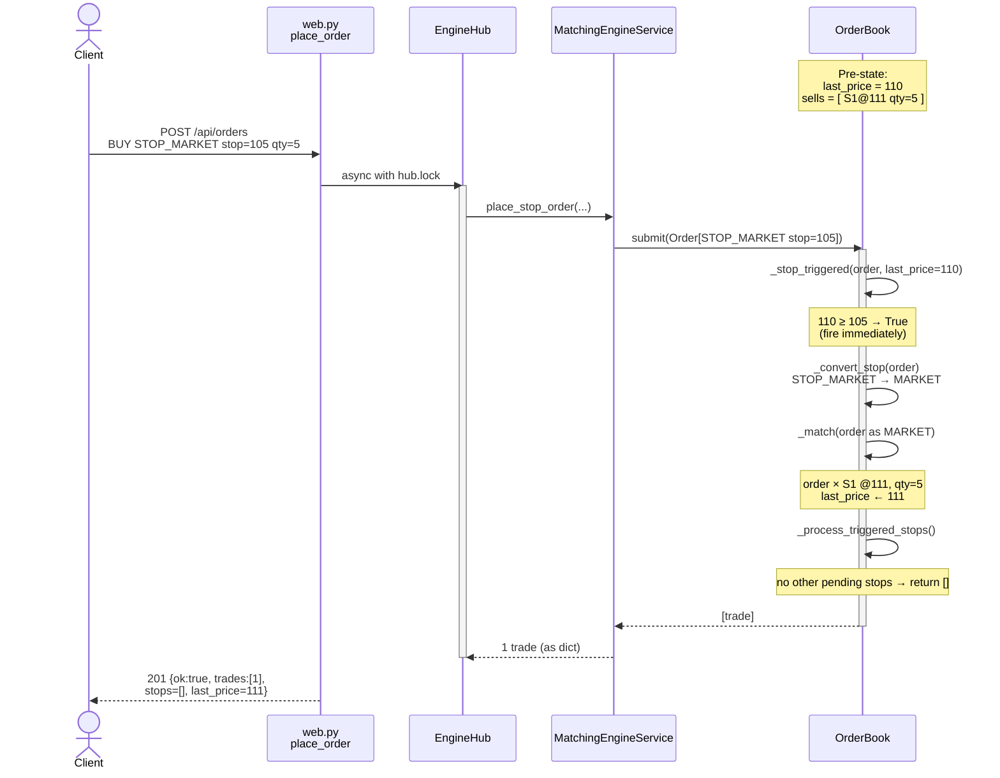
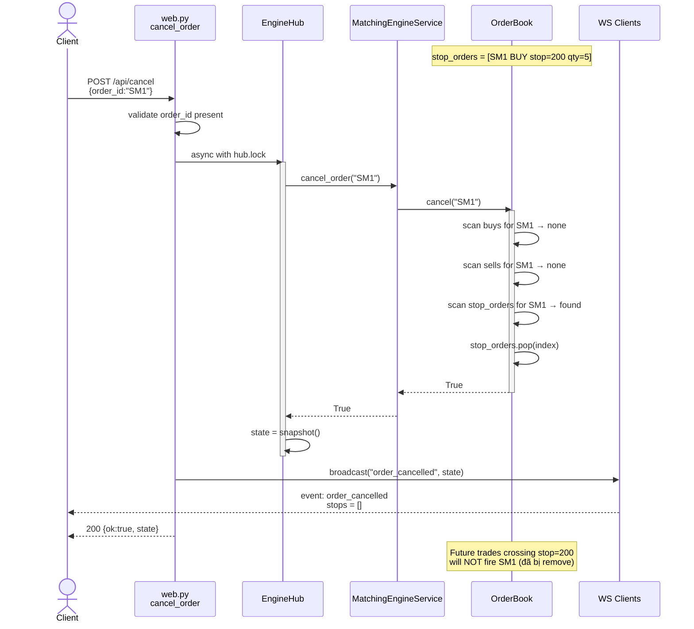

# Stop Order — Sequence Diagrams

Bốn flow chính của tính năng stop order (STOP_MARKET / STOP_LIMIT):

1. **Submit stop — chưa trigger** (pending vào `stop_orders`)
2. **Trade thường trigger cascade** (giá vượt `stop_price` → fire)
3. **Immediate trigger at submit** (`last_price` đã vượt ngưỡng ngay lúc submit)
4. **Cancel pending stop**

---

## 1. Submit Stop Order — Chưa Trigger (Pending)

Client gửi stop order khi `last_price` chưa chạm `stop_price`. Order được parked vào `stop_orders`.

---

## 2. Trade Thường Trigger Cascade

Một trade LIMIT/MARKET bình thường cập nhật `last_price`. Sau khi match xong, engine lặp kiểm tra mọi pending stop — stop nào cross ngưỡng thì được convert và match như MARKET/LIMIT. Trade mới có thể tiếp tục trigger stop tiếp theo → cascade cho đến stable.

---

## 3. Immediate Trigger On Submit

Khi submit stop mà `last_price` đã cross ngưỡng rồi, stop fire ngay trong chính request đó — không parked vào `stop_orders`.

---

## 4. Cancel Pending Stop

`cancel()` tìm `order_id` ở cả `buys`, `sells`, và `stop_orders`. Pending stop bị remove trước khi có thể fire.

---

## Invariants Được Bảo Vệ Qua Các Flow

| Invariant | Đảm bảo bởi |
|-----------|-------------|
| Stop chỉ fire khi `last_price` cross ngưỡng (inclusive) | `_stop_triggered` với `>=` / `<=` |
| Cascade chạy đến stable — không mất trigger | `while eligible: ...` trong `_process_triggered_stops` |
| Cùng trigger moment → FIFO theo timestamp | `eligible.sort(key=lambda s: s.timestamp)` |
| Stop chưa trigger không xuất hiện trong sổ matching | Parked ở `stop_orders` riêng biệt |
| Cancel loại bỏ stop khỏi cả 3 containers | `cancel()` scan buys + sells + stop_orders |
| Atomic vs. concurrent requests | `async with hub.lock` bao quanh mọi mutation |
| WS client thấy state đúng sau cascade | Broadcast dùng state snapshot đã chụp **trong** lock |
